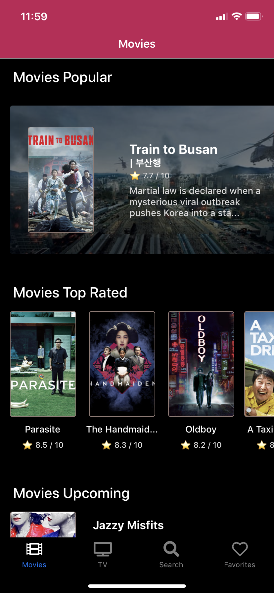
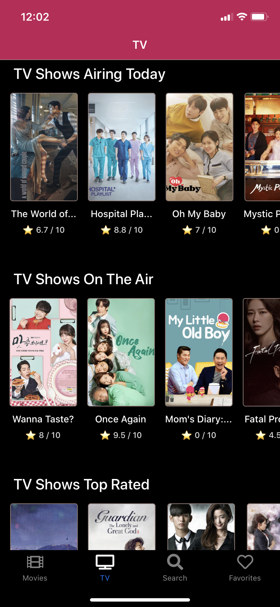
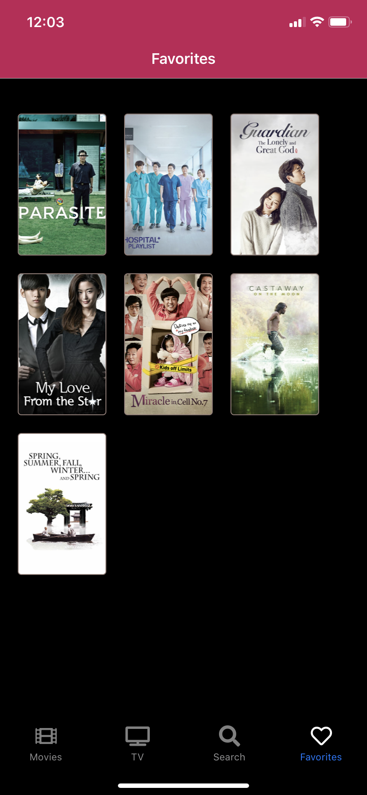
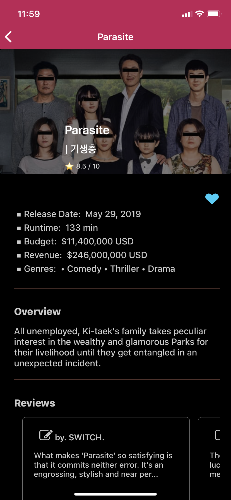
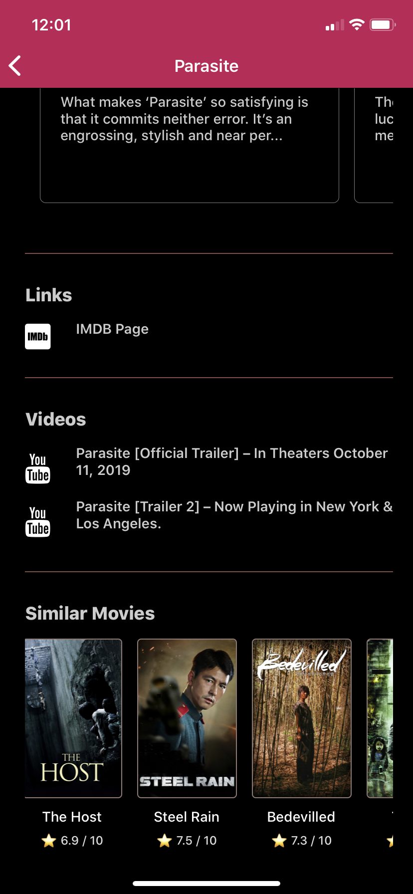
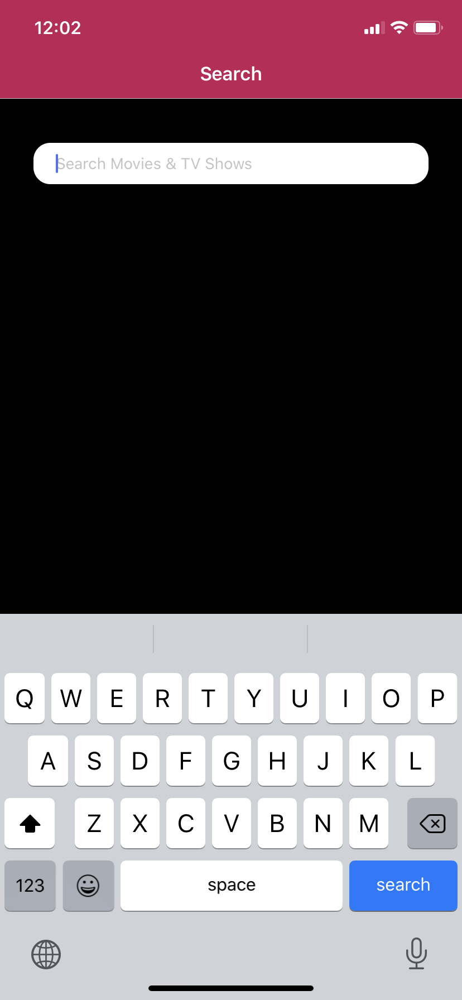
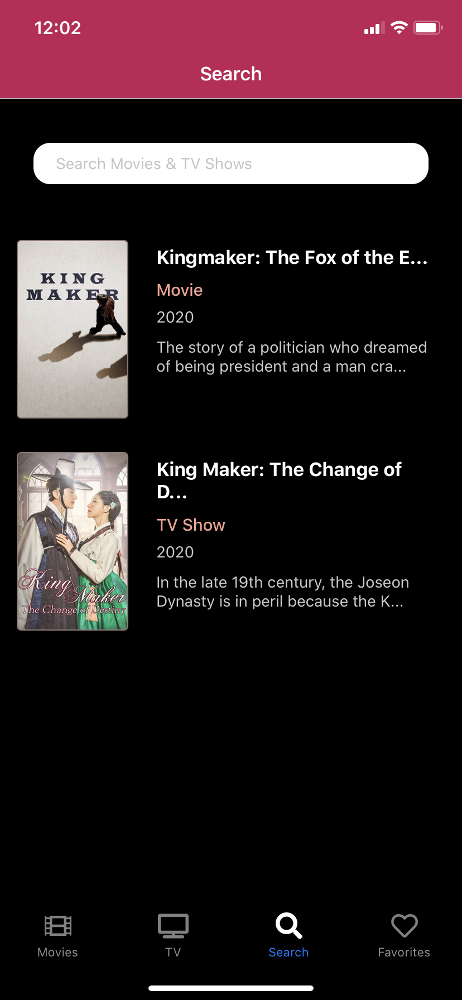
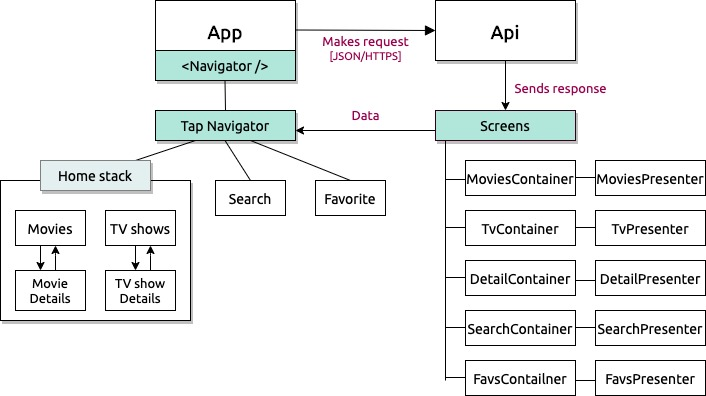

<h1 align="center">
  Koviseries 
</h1> 
<h4 align="center">
  Initiated May 8th, 2020
</h4>
<h4 align="center">
  By Jieun Kang
</h4>
<p align="center">
  
</p>

<p align="center">
  <a href="https://www.repostatus.org/#wip">
    
  </a>
  <a href="#/koviseries/commits/master">
    
  </a>
  <a href="https://lbesson.mit-license.org/">
    
  </a>
  <a href="https://linkedin.com/in/jieun--kang">
    
  </a>
</p>

---

## 1. About the Project

### ▫︎ Description
A mobile application that recommends Korean movies and TV shows.

### ▫︎ Preview
<table>
  <tr>
    <td></td>
    <td></td>
    <td></td>
    <td></td>
  </tr>
  <tr>
    <td></td>
    <td></td>
    <td></td>
    <td></td>
  </tr>
</table>


## 2. Scope

### ▫︎ Use Case
<details>
<summary>Expand Use Case</summary>

The users of this app will be those who are interested in Korean movies and TV shows but are uncomfortable to search with a specific query. Users don’t need to search using filters on existing massive movie applications. I think there are more and more people interested in Korean movies and TV shows these days, but there is not enough app to provide information about them. This application will be focused on that need.

The product will be able to display movies and TV shows that are now playing, popular, upcoming, top-rated, and offer the detail page of each movie or TV show.

The product will offer search functionality and users can mark as a favorite movie or TV show and see them on their favorite list.

</details>

### ▫︎ Minimum-Viable Product
* App for an iOS
* List of movies and TV shows (from API call)
* Detail view of a specific movie or TV show
* Capability to search by title
* Capability to add and display favorite movies or TV shows (without user authentication)

<details>
<summary>▫︎ Future Product Roadmap</summary>

* User registration (database storage)
* User login/sign-out (with database authentication)
* Capability to mark as favorite movie or TV show to the user’s favorite list 
* Capability to rate of a certain movie or TV show
* CRUD functionality for a user’s review
* Capability to display a list of casts in Movie’s detail view and display a detail view of a certain actor
* Capability to display a list of similar movies 
* Capability to search by actor name
* Capability to edit a user’s profile (database storage)
* User authorization (admin)
* Capability to manage movies, TV shows and reviews by admin

</details>  

### ▫︎ Specs
<details>
  <summary>User stories and specifications</summary>

  * As a User, I want to see lists of movies and tv shows. 
  * As a User, I want to be able to click on a movie or TV show to see its detail page.
  * As a User, I want to search for movies or a TV shows by title.
  * As a User, I want to mark as a favorite movie or TV show. 
  * As a User, I want to see list of my favorite movies and TV shows.

</details>  

### ▫︎ Component Diagram 
   

## 3. Get Started  

### ▫︎ Prerequisites
  * Option 1: iOS or Android emulator
  * Option 2: physical device + Expo Client app

### ▫︎ How to use
```
  $ git clone https://github.com/jieunkang-101/koviseries
  $ cd koviseries
  $ npm install  
  $ npm run start or $ expo start
  Run on iOS or Android emulator or scan QR code on your device
```

## 4. Development

### ▫︎ Technologies Used:
  * [NodeJs](https://nodejs.org/en/)
  * [React Native](https://reactnative.dev/) as core stack
  * [Expo](https://expo.io/) to build universal native apps for Android, iOS, Web
  * [AJAX](https://en.wikipedia.org/wiki/Ajax_(programming))
  * [The Movie Database API v3](https://developers.themoviedb.org/3/getting-started/introduction)
  * [npm](https://www.npmjs.com/) for package management
  * [firebase](https://firebase.google.com/) for database

### ▫︎ Dependencies:
  * react
  * react-native
  * react-navigation
  * react-native-dotenv
  * react-native-web-swiper
  * expo
  * expo-web-browser
  * expo-vector-icon
  * styled-component
  * firebase
  * native-base

## 5. Support and Contact

If you have any feedback or concerns, please contact one of the contributors.

### ▫︎  Known Bugs
There are no known bug at this moment.

### ▫︎ License
*This software is licensed under the MIT license*
Copyright (c) 2020 **_Jieun Kang_**